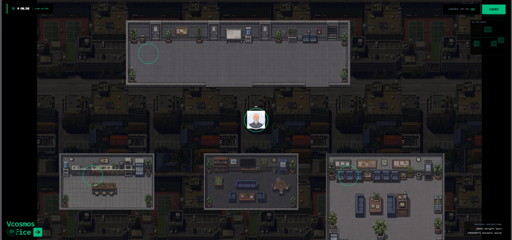
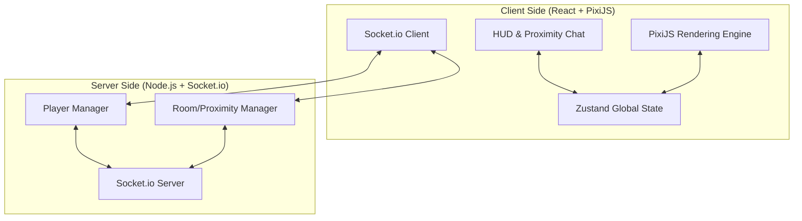

# CoSpace: The Next-Generation Virtual Headquarters

CoSpace is a high-performance, real-time spatial environment designed to bridge the gap between remote work flexibility and physical office presence. Built with **PixiJS v8** and **Socket.io**, it provides a seamless 2D experience where teams can "be together" without the exhaustion of video calls.



## 1. THE CHALLENGE & THE VISION

### The Challenge: "The Digital Void"
Traditional collaboration tools (Slack, Zoom, Teams) are **transactional**. They work well for tasks but fail at **presence**. When you work remotely, you lose the subtle cues of an office: knowing who is busy, who is taking a break, and the spontaneous "over-the-shoulder" conversations that spark innovation.

### The Vision: "Spatial Presence"
CoSpace solves this by introducing **Digital Proximity**. By visualizing your team on a map, we restore the sense of belonging. Communication isn't a button you click; it's a destination you walk to.

---

## 2. SYSTEM ARCHITECTURE



---

## 3. CORE TECHNICAL WORKFLOWS

### A. Real-time Synchronization
1. **Input**: User presses `WASD`.
2. **Local Update**: The PixiJS engine updates the local player's `targetX/Y`.
3. **Emission**: The client emits a `movement` event via Socket.io.
4. **Broadcast**: The server receives the update and broadcasts the new coordinates to all other connected clients.
5. **Lerp**: Remote clients receive the data and smoothly transition (LERP) the remote player's sprite to the new position.

### B. Proximity Logic (The "Magic")
The server continuously monitors the distance between all players.
- **Discovery**: When Player A enters a 250px radius of Player B, a `proximity_enter` event is fired.
- **Connection**: A unique `roomId` is generated, and both players are joined to it.
- **Engagement**: The Proximity Chat UI automatically slides in, enabling instant messaging between the two peers.
- **Departure**: Once the distance exceeds 250px, the room is destroyed and the UI exits gracefully.

---

## 4. DETAILED FEATURE SET

### Immersive Office Map
- **Sector Awareness**: The system detects which island you are on (Dev Area, Kitchen, Lounge) and updates your HUD status.
- **Cosmic Aesthetics**: Animated star fields, parallax background layers, and glowing interaction markers.

### Interactive Hardware Layer
- **Object Interaction**: Proximity-aware points (Workstations, Coffee Machines) that respond to the `[E]` key.
- **Visual Feedback**: Real-time "SUCCESS" notifications and floating labels for clear UX.

### Resilience & Performance
- **Error Shielding**: The render loop is wrapped in safety guards to prevent "Blank Screen" crashes during network hiccups.
- **Asset Fallbacks**: If an avatar image fails to load, the system instantly renders a high-contrast colored profile circle.

---

##  FUTURE ROADMAP

- [ ] **Voice Chat**: Real-time audio based on spatial proximity.
- [ ] **Screen Sharing**: Walk up to a "Projector" to share your screen with anyone nearby.
- [ ] **Custom Avatars**: Deep integration with Ready Player Me or custom pixel-art editors.
- [ ] **Slack/Jira Integration**: See live task updates floating above your workstation.

---

##  INSTALLATION

```bash
# Clone the repo
git clone https://github.com/your-username/cospace

# Install all packages
npm install

# Run development server
npm run dev
```

---

**CoSpace** — *Where your team lives, even when they're miles apart.*
